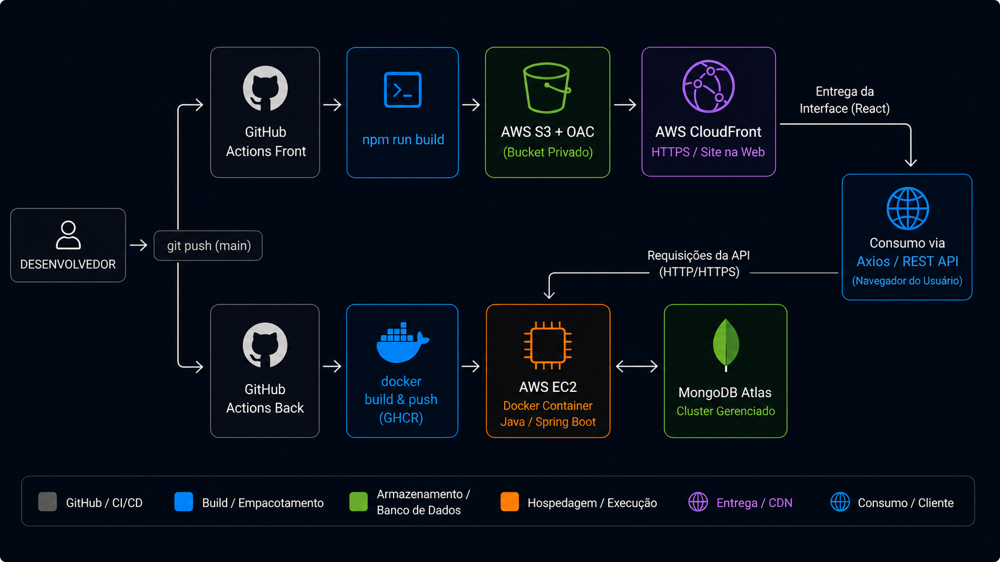

# 📦 Inventory Dashboard — API

API REST para gerenciamento de estoque, construída com Java, Spring Boot, Spring Security (JWT) e banco de dados MongoDB Atlas, implantada em infraestrutura própria na AWS.

## 🚀 Tecnologias Utilizadas

- Java 17
- Spring Boot
- Spring Web
- Spring Security (JWT)
- MongoDB Atlas
- Spring Validation
- JUnit + Mockito (testes)
- Lombok
- Docker

## ☁️ Infraestrutura e CI/CD (AWS & GitHub Actions)

O deploy da aplicação é **100% automatizado** por meio de uma esteira de CI/CD via **GitHub Actions**. A cada `push` na branch `main`, a imagem Docker é compilada, publicada no **GitHub Container Registry (GHCR)** e implantada automaticamente na instância EC2.

| Componente      | Tecnologia                                    |
|-----------------|-----------------------------------------------|
| Servidor        | AWS EC2 (Ubuntu 24.04 LTS, t3.micro)          |
| Automação CI/CD | GitHub Actions                                |
| Image Registry  | GitHub Container Registry (GHCR)              |
| Containerização | Docker                                        |
| Proxy reverso   | Nginx                                         |
| HTTPS/SSL       | Let's Encrypt (Certbot), renovação automática |
| DNS             | DuckDNS                                       |
| Banco de dados  | MongoDB Atlas                                 |
| Firewall        | AWS Security Groups                           |
| IP fixo         | AWS Elastic IP                                |

**API em produção:** `https://inventory-dashboard.duckdns.org`

## 🔄 Fluxo de CI/CD (Como funciona o Deploy)

1. **Trigger:** `git push` para a branch `main`.
2. **Build & Push:** O GitHub Actions compila o projeto, gera o JAR, cria a imagem Docker e envia para o GHCR.
3. **Deploy Automático:** O GitHub Actions se conecta via **SSH** na máquina EC2 da AWS, baixa a nova imagem (`docker pull`) e reinicia o container do backend sem intervenção manual.

---

### Arquitetura

  

---

## ⚙️ Funcionalidades da API

### 🔐 Autenticação
- Login com JWT
- Cadastro de usuário
- Acesso como convidado (guest)
- Filtro de autenticação personalizado
- Rate limiting nas rotas de autenticação (proteção contra força bruta)
- Rotas públicas: `/auth/login`, `/auth/register`, `/auth/guest`

### 📦 Produtos
- Criar produto
- Listar todos
- Atualizar
- Excluir

### ✔️ Validações aplicadas
- Campos obrigatórios
- Validação de preço e quantidade
- DTOs separados para requests/responses

### 🔒 Segurança
- CORS configurado por variável de ambiente (múltiplas origens suportadas)
- Comunicação 100% via HTTPS
- SSH restrito por IP na infraestrutura
- Segredos gerenciados via variáveis de ambiente (nunca commitados)

### 🧪 Testes
O projeto contém testes automatizados:
- Controller tests
- Integration tests
- Service tests
- Validation tests

## 🔗 Projeto relacionado

Frontend: *([ Link do repositório do frontend ](https://github.com/v1nicius28/front-inventory-dashboard))*
